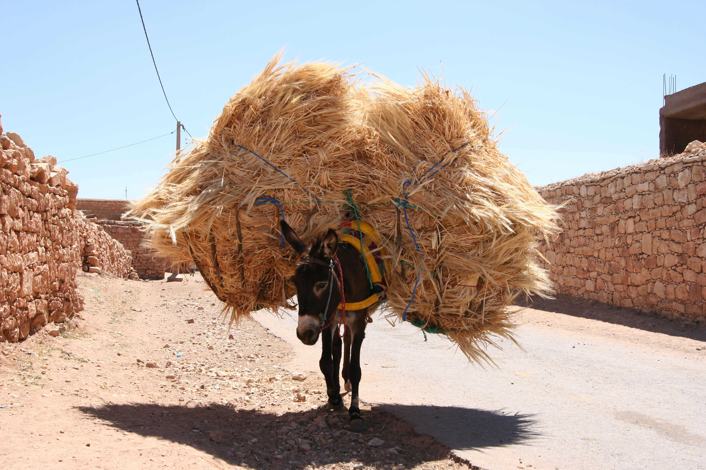

```{r setup, include=FALSE}
library(tidyverse)
library(broom)
library(knitr)
library(ggplot2)
theme_set(theme_bw(base_size = 15))

# Quarto may execute from the repository root or the lecture directory.
donkey_file <- if (file.exists("data/donkey.csv")) {
  "data/donkey.csv"
} else {
  "../data/donkey.csv"
}

donkey <- readr::read_csv(donkey_file, show_col_types = FALSE) |>
  mutate(
    Sex = factor(Sex, levels = c("Female", "Male")),
    AgeGroup = factor(
      if_else(Age < 7, "Under 7", "7 and over"),
      levels = c("Under 7", "7 and over")
    )
  )
```

```{ojs}
//| echo: false
//| output: false
import { multipleRegressionLab } from "./multiple-regression-lab.js"
donkeyWidgetData = FileAttachment("../data/donkey.csv").csv({typed: true})
```

## Learning outcomes

By the end of this lecture, you should be able to:

- fit a model with a numerical predictor and categorical predictors;
- interpret an adjusted slope and a difference from a reference category;
- explain why an adjusted comparison can differ from a raw comparison;
- make predictions at common values of the other predictors; and
- compare ordinary and adjusted R² across models fitted to the same response.

# Back to the Moroccan donkeys {.center}

{fig-align="center" width="82%"}

## One predictor was a start

Last week we fitted body weight against heart girth:

```r
Bodywt ~ Heartgirth
```

Heart girth explains a large amount of the variation in body weight, but
donkeys with the same heart girth can still have different body weights.

. . .

Can some of that remaining variation be explained by age or sex? We can add
those variables while keeping heart girth in the model.

## The data

Each row is one Moroccan donkey. We will keep body weight as the response and
heart girth as our numerical predictor.

This week we will also use two categorical predictors:

- **Age group:** Under 7 versus 7 and over
- **Sex:** Female versus Male

. . .

```{r donkey-counts}
donkey |>
  count(AgeGroup, Sex)
```

## Start with the model from Week 10

```{r heart-model}
heart_model <- lm(
  Bodywt ~ Heartgirth,
  data = donkey
)

summary(heart_model)

ggplot(donkey, aes(Heartgirth, Bodywt)) +
  geom_point(alpha = 0.45) +
  geom_smooth(method = "lm", se = FALSE) +
  labs(
    x = "Heart girth (cm)",
    y = "Body weight (kg)"
  )
```

The slope gives the fitted change in mean body weight for a one-centimetre
difference in heart girth.

## Add age group

That model fits one line for all donkeys. What if we allow younger and older
donkeys to have different fitted mean body weights at the same heart girth?

We add `AgeGroup` to the formula: `Bodywt ~ Heartgirth + AgeGroup`. Let's fit
the model and look at the lines.

```{r age-model}
age_model <- lm(
  Bodywt ~ Heartgirth + AgeGroup,
  data = donkey
)

age_plot_data <- donkey |>
  mutate(fitted = predict(age_model)) |>
  arrange(AgeGroup, Heartgirth)

ggplot(age_plot_data, aes(Heartgirth, Bodywt)) +
  geom_point(aes(colour = AgeGroup), alpha = 0.45) +
  geom_line(
    aes(y = fitted, colour = AgeGroup, group = AgeGroup),
    linewidth = 1
  ) +
  labs(
    x = "Heart girth (cm)",
    y = "Body weight (kg)",
    colour = "Age group"
  )
```


## Add Age Group Con't

That made a set of parallel lines with one for each of the age groups. But what happened to the model summary:

```{r modelsummary}


tidy(age_model)
```


We have a new term `AgeGroup7 and over` with a value of 4.05. This creates two intercepts but keeps a single slope.

Specifically, the fitted equations are:

For donkeys under 7, the fitted mean is

$$
\widehat{\mathrm{Bodywt}} =
\hat\beta_0 + \hat\beta_1\,\mathrm{Heartgirth}.
$$

For donkeys aged 7 and over, it is

$$
\widehat{\mathrm{Bodywt}} =
(\hat\beta_0+\hat\beta_2) +
\hat\beta_1\,\mathrm{Heartgirth}.
$$

Both groups share \(\hat\beta_1\), so the fitted lines are parallel.

## Reference Category

R uses the first factor level as the reference category. We set `Under 7`
first when we created `AgeGroup`, so it is the reference group. Changing the
reference category changes how the coefficients are written and interpreted,
but not the fitted values.

.  .  .

The model matrix has a column called `AgeGroup7 and over`:

- 0 for donkeys under 7
- 1 for donkeys aged 7 and over

.  .  .

For the reference group, that term drops out. For the other group, its
coefficient is added to the fitted value.


## Observed mean body weight

The mean body weight across all donkeys is 122.39 kg. Splitting the data by age
group gives two quite different means:

```{r raw-adjusted-age}
raw_age_means <- donkey |>
  group_by(AgeGroup) |>
  summarise(
    mean_body_weight = mean(Bodywt),
    mean_heart_girth = mean(Heartgirth),
    .groups = "drop"
  )

bind_rows(
  donkey |>
    summarise(
      AgeGroup = "All donkeys",
      mean_body_weight = mean(Bodywt),
      mean_heart_girth = mean(Heartgirth)
    ),
  raw_age_means |> mutate(AgeGroup = as.character(AgeGroup))
) |>
  knitr::kable(
    digits = 2,
    col.names = c("Group", "Mean body weight (kg)", "Mean heart girth (cm)")
  )
```

Donkeys aged 7 and over weigh 16.51 kg more on average. They also have a
larger mean heart girth. This raw difference compares the groups as observed;
it does not hold heart girth fixed.

## Compare age groups at the same heart girth

Use the age-group model to predict **mean body weight** for both groups at a
heart girth of 115 cm:

```{r common-age-means}
common_age_donkeys <- data.frame(
  Heartgirth = c(115, 115),
  AgeGroup = factor(
    c("Under 7", "7 and over"),
    levels = levels(donkey$AgeGroup)
  )
)

common_age_donkeys |>
  mutate(fitted_mean_body_weight = predict(
    age_model, newdata = common_age_donkeys
  )) |>
  select(AgeGroup, Heartgirth, fitted_mean_body_weight) |>
  knitr::kable(
    digits = 2,
    col.names = c("Age group", "Heart girth (cm)", "Fitted mean body weight (kg)")
  )
```

The fitted means are 128.25 kg and 132.30 kg, a gap of 4.05 kg. This is the
age-group coefficient: the age comparison **adjusted for heart girth**. Because
the lines share a slope, the 4.05 kg gap is the same at any heart girth.

## Why are the group means 16.5 kg apart?

The 16.51 kg raw gap and the 4.05 kg fitted gap use different heart-girth
values. To connect them, use the fitted age-group model:

$$
\widehat{\mathrm{Bodywt}} =
-188.55 + 2.7547\,\mathrm{Heartgirth} + 4.05\,I(\text{7 and over}),
$$

where $I(\text{7 and over})$ is 0 for the younger group and 1 for the older
group.

. . .

The two groups have different average heart girths:

$$
\overline{\mathrm{Heartgirth}}_{\text{under }7} = 109.39\text{ cm}, \qquad
\overline{\mathrm{Heartgirth}}_{7\text{ and over}} = 113.91\text{ cm}.
$$

## Recover the observed age-group means

Plug each group's own average heart girth into the **same model**:

$$
\widehat{W}_{\text{under }7} = -188.55 + 2.7547(109.39) \approx 112.78\text{ kg},
$$

$$
\widehat{W}_{7\text{ and over}} = -188.55 + 2.7547(113.91) + 4.05 \approx 129.29\text{ kg}.
$$

These fitted values match the raw group means, because each group's own mean
heart girth reproduces its own mean body weight in this model.

## Splitting the 16.5 kg apart

Subtracting the two predictions cancels the intercept:

$$
\begin{aligned}
\widehat{W}_{7\text{ and over}} - \widehat{W}_{\text{under }7}
&= 2.7547(113.91 - 109.39) + 4.05 \\
&= 12.45\text{ kg} + 4.05\text{ kg} \\
&\approx 16.51\text{ kg}.
\end{aligned}
$$

. . .

> **12.45 kg** comes from evaluating the model at the groups' different average
> heart girths.
>
> **4.05 kg** is the fitted age-group difference **when heart girth is held the
> same** — the coefficient from the adjusted model.

. . .

Both numbers come from the same fitted model. The 16.51 kg gap uses each
group's own mean heart girth. The 4.05 kg gap holds heart girth fixed, so it
answers the like-for-like age-group question more directly.

## Add another factor: Sex

The age-group term gives us a like-for-like comparison and slightly improves
model fit. Does `Sex` explain any remaining variation once heart girth and age
group are included? We add it with another `+`.

```{r full-model}
full_model <- lm(
  Bodywt ~ Heartgirth + AgeGroup + Sex,
  data = donkey
)

tidy(full_model)
```

. . .

With Female as the reference category, `SexMale` is the fitted Male-minus-
Female difference for donkeys with the same heart girth and in the same age
group.

. . .

Nothing about adding Sex changes the meaning of the heart-girth slope: it is
still the fitted change in mean body weight for a one-centimetre difference in
heart girth, holding the other predictors fixed.

## What does "holding the others fixed" mean?

In the full model:

- the **Heartgirth** coefficient compares donkeys differing by 1 cm in heart
  girth but with the same age group and sex;
- the **AgeGroup** coefficient compares age groups at the same heart girth and
  sex;
- the **Sex** coefficient compares males and females at the same heart girth
  and age group.

. . .

That is what an adjusted coefficient is doing. Each coefficient answers its
comparison after accounting for the other terms in the model.

## One slope, several shifted lines

The full model is still additive. There is one common heart-girth slope.

```{r full-model-plot}
full_plot_data <- donkey |>
  mutate(fitted = predict(full_model)) |>
  arrange(AgeGroup, Sex, Heartgirth)

ggplot(full_plot_data, aes(Heartgirth, Bodywt)) +
  geom_point(aes(colour = Sex), alpha = 0.35) +
  geom_line(
    aes(
      y = fitted,
      colour = Sex,
      linetype = AgeGroup,
      group = paste(Sex, AgeGroup)
    ),
    linewidth = 1
  ) +
  labs(
    x = "Heart girth (cm)",
    y = "Body weight (kg)",
    colour = "Sex",
    linetype = "Age group"
  )
```

Four groups give four fitted lines, but all four lines have the same slope.
The factor terms only shift the fitted mean up or down.

## Estimates have uncertainty

```{r full-model-summary}
summary(full_model)$coefficients
```

The values in `Estimate` are estimates from this sample. The population
coefficients are fixed but unknown. If we collected another comparable sample
of donkeys, we would get slightly different fitted coefficients.

Technically, least squares is the **estimator**, the rule used to calculate a
coefficient. The numerical value returned for this particular sample is the
**estimate**.

. . .

`Std. Error` estimates how much that coefficient estimate would vary across
repeated comparable samples under the model. It is not the spread of individual
donkey body weights around the fitted lines.

. . .

The `t statistic` compares the estimate with its standard error, and the `p-value`
tests a zero population coefficient. For a factor row, that null hypothesis is
a zero adjusted difference from the reference category.

A large p-value is not evidence that the groups are identical. It means these
data do not provide strong evidence for an adjusted difference. We will make
the repeated-sampling logic and confidence intervals explicit next week.

## Predict with the heart-girth model

Last week, a donkey with a heart girth of 115 cm had one fitted mean body
weight from the model with heart girth alone:

```{r heart-prediction}
predict(heart_model, newdata = data.frame(Heartgirth = 115))
```

. . .

Now keep heart girth at 115 cm and ask for a fitted mean for each combination
of age group and sex.

```{r common-predictions}
new_donkeys <- data.frame(
  Heartgirth = c(115, 115, 115, 115),
  AgeGroup = c("Under 7", "Under 7", "7 and over", "7 and over"),
  Sex = c("Female", "Male", "Female", "Male")
)

new_donkeys$predicted_body_weight <- predict(full_model, newdata = new_donkeys)
new_donkeys
```

Every row has the same heart girth. The differences among these fitted means
come from the age-group and sex coefficients.

## Compare donkeys at the same heart girth

Move the heart-girth marker: fitted means change, but the gaps between groups
stay constant. Change a reference category: coefficients change, but fitted
means do not.

```{ojs}
//| echo: false
multipleRegressionLab({ Plot, data: donkeyWidgetData })
```

## Does every extra term improve the model?

Compare four models fitted to exactly the same response and the same donkeys.

```{r model-fit}
sex_model <- lm(
  Bodywt ~ Heartgirth + Sex,
  data = donkey
)

model_fit <- bind_rows(
  glance(heart_model) |>
    mutate(model = "Heart girth"),
  glance(age_model) |>
    mutate(model = "Heart girth + age group"),
  glance(sex_model) |>
    mutate(model = "Heart girth + sex"),
  glance(full_model) |>
    mutate(model = "Heart girth + age group + sex")
) |>
  select(model, nobs, r.squared, adj.r.squared)

stopifnot(n_distinct(model_fit$nobs) == 1)

model_fit
```

Ordinary R² cannot fall when we add terms to a model fitted to the same
observations.

Adjusted R² asks whether the improvement is large enough to justify estimating
another coefficient. Here, `age group` earns its place more clearly. Adding `Sex`
after `age group` increases ordinary R² a little, but adjusted R² is essentially
unchanged and is slightly lower.

## Why adjusted R² can go down

Adding a term gives the model another way to fit the observed data. So ordinary
R² can only stay the same or increase.

Adjusted R² applies a penalty for estimating more coefficients. If the new term
does not reduce the residual variation enough, the penalty is larger than the
gain and adjusted R² falls.

$$
R^2_{\mathrm{adj}} = 1 - (1-R^2)\frac{n-1}{n-p-1},
$$

where $n$ is the number of donkeys and $p$ is the number of predictor
coefficients, excluding the intercept. Adding a term increases $p$, so $R^2$
must rise enough to offset the larger fraction.

That does **not** prove the term has no scientific importance. It tells us that,
in this fitted model and sample, the extra term has added little explanatory
information.

Adjusted R² does not give us a statistical test of the extra term. Next week
we will use a test to ask whether the data provide evidence that it contributes
information.

## What have we assumed?

An additive model gives each age and sex group its own vertical shift, while all
groups share the same heart-girth slope. The fitted lines are parallel by
construction.

If the slopes differ between groups, we need an interaction term. We have not
fitted interactions in this lecture.

## What changes when we add more predictors? {style="font-size: 24px;"}

**We can now compare like with like.**

- **Coefficients become conditional comparisons.** The heart-girth slope
  compares donkeys with the same age group and sex. Factor coefficients compare
  groups at the same values of the other predictors.
- **Raw and adjusted differences answer different questions.** Older donkeys
  weigh **16.51 kg more on average**, but only **4.05 kg more at the same heart
  girth**. Both are correct. They are different comparisons.
- **An additive model gives us parallel fitted lines.** Age group and sex shift
  the fitted mean up or down while the heart-girth slope stays the same. Changing
  the reference group changes the coefficients, not the fitted values.
- **Prediction puts the model back together.** Give `predict()` a heart girth,
  age group and sex, and it returns the fitted mean for that combination.
- **More terms cannot decrease ordinary $R^2$, but can decrease adjusted
  $R^2$.** Adjusted $R^2$ penalises additional coefficients, so it can fall. It
  is a measure of model fit, not a formal test of whether a term contributes.

. . .

**Everything here is estimated from a sample. Next week we ask how uncertain
those estimates are, and whether the model assumptions are credible.**
